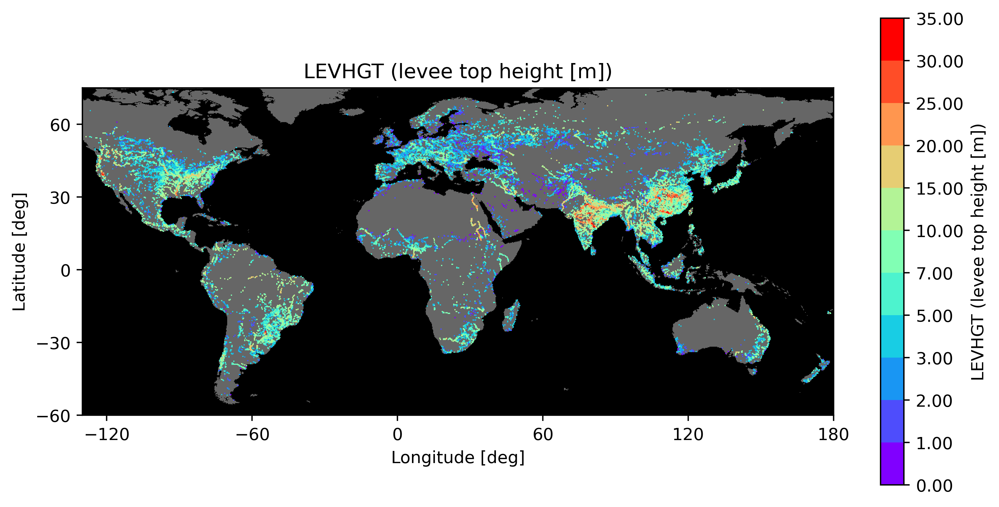
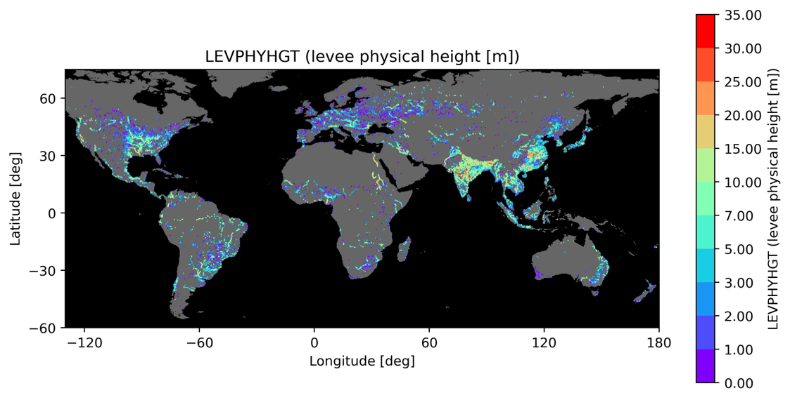

# CaMa-Flood Levee Parameter Preparation

**Authors:** Dai Yamazaki, Gang Zhao, Do Ngoc Khanh  
**Last Updated:** 2025-11-25

**This document provides a technical description** of parameter
preparation for the **CaMa-Flood Levee Scheme (v4.30 and later)**,
including:

- Descriptions of required input data

- End-to-end workflow using scripts (s01, s02, s03, s04, x01)

- Full parameter definitions and their scientific meaning

- Algorithmic outlines (full mathematical/technical detail kept in
  Appendix)

# 1. Introduction

The CaMa-Flood levee scheme enables global representation of levees
(river embankments) by assigning two key parameters to each CaMa
unit-catchment: levee relative distance (levee unprotected fraction;
**LEVFRC**) and levee crown height relative to the river channel
(**LEVHGT**).

Preparing these parameters requires the following inputs:

1.  **High-resolution river–levee distance**: Distance between the river
    centerline and the levee on the MERIT Hydro / J-FlwDir river map.

2.  **Flood Protection Standard**: Return period corresponding to the
    flood protection level of each catchment (FLOPROS).

3.  **Target CaMa-Flood river network map**: The CaMa-Flood river
    network map to which levee parameters will be added.

The scripts are designed to calculate levee parameters (**LEVFRC** and
**LEVHGT**) for a CaMa-Flood river network map:

- The sample code is designed for the global 15-min map (**glb_15min**).

- It can be modified for any **user-defined CaMa-Flood map**, including
  regional or custom-resolution maps. → The target map directory is
  specified in **s01-calc_levee_fraction.sh**.

A sample levee parameter package is distributed on the CaMa-Flood
webpage. Please download the following file (registration and password
are required): **levee_v430.tar.gz** (place under **etc/levee_v430/**)

#### CaMa-Flood levee scheme reference (Zhao et al., 2025, WRR):

**Developing a Levee Module for Global Flood Modeling With a Reach‐Level
Parameterization Approach** Gang Zhao, Dai Yamazaki, Yoshiaki Tanaka,
Xudong Zhou, Shuping Li, Yang Hu, Yukiko Hirabayashi, Jeff Neal, Paul
Bates *Water Resources Research, 61, e2024WR039790, 2025*
<https://doi.org/10.1029/2024WR039790>

#### Official resources:

- CaMa-Flood product webpage:
  <https://hydro.iis.u-tokyo.ac.jp/~yamadai/cama-flood/>

- CaMa-Flood GitHub repository:
  <https://github.com/global-hydrodynamics/CaMa-Flood_v4>

- CaMa-Flood user group (Google Group):
  <https://groups.google.com/g/cama-flood-user>

# 2. Workflow Overview

The workflow of the sample package is as follows.

1.  LEVFRC calculation (**s01-calc_levee_fraction.sh**)

2.  FLOPROS resolution conversion (**s02-conv_FLOPROS_res.sh**)

3.  Initial simulation with infinite LEVHGT (**s03-cycle_sim00.sh**)

4.  Re-simulation using updated LEVHGT parameter
    (**s04-cycle_sim01.sh**)

5.  Internal levee parameter computation (**x01-calc_levbaseheight.sh**)

s01 and s02 are for pre-process levee fraction (LEVHGT) and protection
level. Then, levee height (LEVHGT) is estimated by simulation (s03 and
s04). Post-processing script (x01) is optional, and output is not
required in simulations.

# 3. Input Datasets and Variable Definitions

## 3.1 Levee Distance Dataset

**File:** **data/levdis_Zhao2025_glb3sec.txt**

Contains MERIT Hydro 3″ river-centerline pixels and their distance to
mapped levees:

> lat, lon, drainage_area\[km²\], distance_to_levee\[m\], pixel_type

**pixel_type definitions:** - **0 = land or narrow river pixel** - **1 =
lake pixel** - **3, 4 = river pixel** - **6 = ice pixel**

**Example entries (sample rows):**

``` code
-51.881 -72.553 1260.951 6426.000 4
-50.225 -72.549 5819.595 12600.000 1
-51.700 -72.549 10140.238 1122.000 3
-50.225 -72.548 5819.897 12600.000 1
-50.992 -72.548 809.103 101.000 0
-50.225 -72.548 5819.925 12510.000 1
```

These points represent the nearest distance from the river centerline to
the levee’s crest line. They are mapped to CaMa unit-catchments by
**s01-calc_levee_fraction.sh** script, to estimate levee presence and
levee fraction.

## 3.2 FLOPROS 30-second dataset

**File:** **data/FLOPROS_shp_V1_30s_filled.tif** - Represents
**protection level (return period)** at global scale. The “merged” layer
of FLOPROS dataset is used. - Ocean is filled to prevent missing values
due to land-sea mask difference. - Regridded to CaMa-Flood grid in
**s02-conv_FLOPROS_res.sh** script.

#### FLOPROS reference (Scussolini et al., 2016, NHESS):

**FLOPROS: an evolving global database of flood protection standards.**
Scussolini, P., Aerts, J. C., Jongman, B., Bouwer, L. M., Winsemius, H.
C., de Moel, H., & Ward, P. J. (2016). *Natural Hazards and Earth System
Sciences, 16(5), 1049-1061.*
<https://doi.org/10.5194/nhess-16-1049-2016>

## 3.3 CaMa-Flood Map and Required Internal Files

This workflow operates on a **CaMa-Flood map directory**, which defines
the spatial grid, river network, floodplain structure, and all physical
parameters needed for the levee scheme.

A sample map (global, 15-minute resolution) is distributed as
**glb_15min** in the CaMa-Flood package from the webpage, but **any
user-defined map can be used**.

The map directory is specified in **s01-calc_levee_fraction.sh** and
must contain the following files:

``` code
MAPDIR="../../map/glb_15min/" # map directory
HIGHRES="1min" # high-res file to analyze (default: global=1min, Japan=15sec)
```

#### Core CaMa-Flood Map Files

These define the geometry and structure of each CaMa unit-catchment:

| File           | Meaning                                                                  |
|----------------|--------------------------------------------------------------------------|
| **params.txt** | Map configuration (nx, ny, gsize, floodplain layers NLFP, domain extent) |
| **uparea.bin** | Upstream drainage area \[m²\]; also used as land/sea mask (−9999 = sea)  |
| **rivlen.bin** | River channel length in each unit-catchment \[m\]                        |
| **rivwth.bin** | River width \[m\]                                                        |
| **grdare.bin** | Unit-catchment area \[m²\]                                               |
| **fldhgt.bin** | Floodplain elevation layers (NLFP layers per grid cell)                  |

These files are essential because levee parameters depend on: -
**Channel width (rivwth)** → used to constrain minimum levee distance -
**Catchment width (ctmare / rivlen)** → used for LEVFRC normalization -
**Floodplain elevation structure (fldhgt)** → optionally required to
compute levee base height and storage (via **calc_baseheight.py**)

# 4. Detailed Workflow

## 4.1 Step 1 - LEVFRC Calculation

Script **s01-calc_levee_fraction.sh** is used for calculating **levee
unprotected fraction**, LEVFRC using high-resolution levee distance
pixels.

Note: The Fortran90 code **calc_levfrc.F90** in **src/** directory
should be compiled by **make all** command.

The target CaMa-Flood map should be specified in
**s01-calc_levee_fraction.sh**

``` code
MAPDIR="../../map/glb_15min/" # map directory
HIGHRES="1min" # high-res file to analyze (default: global=1min, Japan=15sec)
```

Levee unprotected fraction LEVFRC (or levee relative distance within
unit-catchment) is defined as:

``` code
LEVFRC = 2 × Average_distance_to_levee / Catchment_width
```

Value ranges: - **0.0 → levee very close to river** - **1.0 → levee
absent / very far**

#### Algorithm (simplified): 

1.  Read CaMa-Flood high-resolution map (e.g., glb_15min/1min/)

2.  Identify **mainstem pixels** using upstream area threshold (\>50% of
    outlet uparea)

3.  Read levee distance pixel list

4.  Map levee distance pixel to CaMa unit-catchment

5.  Compute levee coverage ratio of the catchment mainstem and determine
    levee presence

6.  Calculate average levee distance per catchment

7.  Calculate levee unprotected fraction LEVFRC, using catchment width
    (ctmare/rivlen)

#### Output files:

\- **levfrc.bin** — levee unprotected fraction (or levee relative
distance in unit-catchment, 0-1)

\- **levhgt_sim00.bin** — initial “infinite levee height” (default=100
m)

Full Fortran90-level implementation is described in **Appendix A1**.

## 4.2 Step 2 — FLOPROS Resolution Conversion

The script **s02-conv_FLOPROS_res.sh** Interpolates FLOPROS flood
protection standard to CaMa-Flood grids.

Reads 30sec FLOPROS geoTiff and CaMa-Flood map

Performs **nearest-grid sampling**

#### Outputs:

\- **protect.tif**

\- **protect.bin** (float32, little endian)

Algorithmic details in **Appendix A2**.

## 4.3 Step 3 — Initial CaMa-Flood Simulation

The script **s03-cycle_sim00.sh** runs CaMa-Flood for a long simulation
period (e.g., 1980–2010) with **initial infinite levees height** to
obtain river water level timeseries. Then, extreme value analysis is
performed to estimate return-period equivalent river water level, and
then levee height corresponding to FLOPROS protection level is
determined.

The infinite levee height is used to obtain river water levels under
“fully protected” condition. (because upstream levee can affect
downstream hydrodynamics)

#### Procedure: 

Run CaMa-Flood for all years (e.g., 1980–2010) - Extract daily water
levels → annual maxima - Fit **Gumbel distribution** → estimate RP water
level (from FLOPROS)

#### Output: 

- **levhgt_sim01.bin** — updated levee height

### (1) Running CaMa-Flood

The shell script to run CaMa-Flood \`t01-run_cmf_levee.sh’ is called,
and long-term simulation is executed.

#### ⚠ Required Input: Long-term Runoff Data (e.g. ERA5-Land)

To run CaMa-Flood, **users must prepare their own runoff input data**. -
Recommended datasets: **ERA5-Land**, **Earth2Observe**, **GRADES** or
other land surface model outputs - Format: typically **NetCDF** or
**CaMa-Flood runoff binary VAR_YYYYMMDD.bin** format - Edit the input
path in the script **t01-run_cmf_levee.sh** accordingly

During simulation, CaMa-Flood will: - Read daily/hourly runoff - Route
it through the river network - Output water level variables (e.g.,
**rivdph**, **sfcelv**)

#### Namelist Key Settings

Please specify below to activate levee scheme, and using levee parameter
maps.

``` code
LLEVEE = .TRUE.
CLEVFRC = map/levfrc.bin
CLEVHGT = map/levhgt_sim00.bin
```

#### Output

- Daily water levels

### (2) Extreme value analysis

Following the simulation, a script to perform extreme value analysis
\`t02-calc_levee_height.sh’ is called.

#### Procedures

- annual maximum water level is calculated from long-term daily water
  level.

- Extreme value analysis using Gumbel distribution is performed.

- River water level corresponding to the FLOPROS protection standard is
  calculated.

- The estimated water level is treated as levee height LEVHGT (relative
  height above river channel).

- The output levee height LEVHGT is saved as: **levhgt_sim01.bin** This
  updated LEVHGT is used for the next-cycle simulation.

Full extreme value analysis in **Appendix A3**.

## 4.4 Step 4 — Second CaMa-Flood Simulation

The script **s04-cycle_sim01.sh** repeats Step 3 using updated heights:

``` code
CLEVHGT = map/levhgt_sim01.bin
```

to estimate levee height considering upstream-downstream interactions.

#### Outputs:

- **levhgt_sim02.bin**

If needed, repeat until convergence. Once the levee height is converged,
save that levee height parameter map as **levhgt.bin**.

## 4.5 Step 5 (optional) — Additional Levee Parameter Computation

In this step, **x01-calc_levbaseheight.sh** transforms LEVFRC + LEVHGT
into **all internal CaMa levee parameters**:

| Variable       | Meaning                                                       |
|----------------|---------------------------------------------------------------|
| **LEVDST**     | Mean Distance from channel center to levee \[m\]              |
| **LEVBASHGT**  | Elevation of levee base (ground level at levee position)      |
| **LEVPHYHGT**  | Physical levee height = LEVHGT − LEVBASHGT                    |
| **LEVHGT_MOD** | LEVHGT masked for invalid cells (LEVHGT lower than LEVBASHGT) |
| **LEVBASSTO**  | Storage at levee base (river-side)                            |
| **LEVTOPSTO**  | Storage at levee crest elevation (river-side)                 |
| **LEVFILSTO**  | River+Floodplain storage when levee is fully sink             |

These parameters are internally calculated in CaMa-Flood simulation, but
not requirted as input for CaMa-Flood. They can be used for some
purposes, such as pre/post-processing flood stage from water storage.

All formulas and layer-integration logic are in **Appendix A4**.

Generated files are placed in the map directory.

# 5. Running CaMa-Flood with Levee Scheme

## Namelist setting

To activate the levee scheme in CaMa-Flood, modify NAMELIST settings as
follows:

> LLEVEE = .TRUE.  
> CLEVFRC = \${FMAP}/levfrc.bin  
> CLEVHGT = \${FMAP}/levhgt.bin

## Adding Levee Variables to Output (CVARSOUT)

When using the levee scheme, **additional output variables** become
available. To write these variables to NetCDF or binary output, they
must be explicitly added to **CVARSOUT** in the NAMELIST.

#### Example CVARSOUT setting

> CVARSOUT = "sfcelv rivdph flddph levsto levdph"

Where: - **levsto** = Storage on the protected side of the levee -
**levdph** = Water depth in protected side

These variables **will not appear in outputs** unless listed in
CVARSOUT. Example:

> CVARSOUT = "sfcelv rivdph levsto levdph"

# 6. Visualization

To easily inspect parameter maps generated by the levee scheme, a
**sample visualization script visualize.py** is provided. This script
reads levee‑related parameters from the CaMa‑Flood map directory and
outputs them as PNG images.

**visualize.py** visualizes the three key levee‑scheme parameter maps:

- **LEVFRC (levfrc.bin)**  
  **Levee unprotected fraction.**  
  Meaning of values:

  - Close to **0** → Levees are located very near the river channel
    (strong protection).

  - Close to **1** → No levees or levees located far from the river
    (weak or no protection).


Figure: Levee Unprotected Fraction (LEVFRC)

- **LEVHGT (levhgt.bin or levhgt_simXX.bin)**  
  **Levee crest height.**  
  Represents the absolute elevation \[m\] of the levee crest, derived
  from FLOPROS return‑period water levels combined with CaMa’s
  river‑reference elevation (**rivhgt**).



Figure: Levee Crown Height (LEVHGT)

- **LEVPHYHGT (levphyhgt.bin)**  
  **Physical levee height.**  
  The effective structural height of the levee, calculated as:

<!-- -->

- **LEVPHYHGT = LEVHGT − LEVBASHGT**

  where **LEVBASHGT** is the ground elevation at the levee base. Values
  ≤ 0 are treated as “no levee.”



Figure: Levee Physical Height (LEVPHYHGT)

A land–sea mask is drawn using **uparea.bin**, allowing clear visual
distinction between land areas (rivers and floodplains) and ocean cells.
is drawn using **uparea.bin**, allowing clear visual distinction between
land areas (rivers and floodplains) and ocean cells.

# Appendix — Detailed Algorithms

- **A1. calc_levfrc.F90** — full mapping logic and mainstem detection

- **A2. FLOPROS resampling** — resolution ratio and masking

- **A3. calculate_levhgt.py** — annual maxima + Gumbel (L-moments)

- **A4. calc_baseheight.py** — floodplain layer structure and storage
  integration

- **A5. visualize.py** — thickening + discrete colormap rules

## Appendix 1. Overview of **calc_levfrc.F90**

The step-1 script **s01-calc_levee_fraction.sh** calls Fortran90 code
**calc_lkevfrc.F90**.

**Note: The Fortran90 code in src/ directory should be compiled in
advance, for example using make all.**

**calc_levfrc.F90** computes the levee-related parameters needed for the
CaMa-Flood levee scheme, mainly:

- **LEVFRC (levfrc.bin)** – levee *unprotected fraction*

- **Initial LEVHGT (levhgt_sim00.bin)** – initial “infinite” levee
  height

The program aggregates **high-resolution levee distance data** onto the
coarse CaMa-Flood unit-catchment grid.

## A1.1 Inputs

### (1) Command-line arguments

Command-line arguments are specified by **s01-calc_levee_fraction.sh**.

4.  **High-resolution map resolution** (e.g., **1min**, **30sec**)

5.  **Levee distance list** (**levlist**)

- Contains levee distances at fine resolution:

  lat lon drainage_area\[km2\] distance_to_levee\[m\] class

6.  **Resolution of levee list** (e.g., **3sec**)

7.  **River width file** (**rivwth_gwdlr.bin**)

### (2) CaMa-Flood map files

- **uparea.bin** – upstream drainage area

- **ctmare.bin** – catchment area

- **rivlen.bin** – channel length

- **rivwth.bin** – river width

- **class.bin** – land/river mask

- High-resolution mapping files **catmxy**, **uparea** (e.g. in
  glb_15min/1min/ directory.)

These allow mapping fine-resolution levee distance pixels to CaMa-Flood
unit-catchments.

## A1.2 Outputs

1.  **levfrc.bin**  
    Levee unprotected fraction (0–1)

    - 0.0 → levee close to channel

    - 1.0 → levee absent or very far

    - −9999 → ocean or no levee information

2.  **levhgt_sim00.bin**  
    Initial levee height (typically 100 m for levee cells)

3.  **Diagnostic files**

    - **tmp/levfrc_stat.txt** – levee statistics

    - **tmp/tmp.bin** – intermediate data dump

## A1.3 Algorithm Overview

### Step 1 — Mainstem identification

Mainstem pixels on high-resolution grid are identified using an
upstream-area ratio threshold:

``` code
area_highres > 0.5 × uparea(unit-catchment)
```

These pixels form the reference for levee detection.

### Step 2 — Mapping levee pixels

For each levee-list point:

1.  Convert (lon, lat) → high-res grid index (ix,iy)

2.  Map to its CaMa-Flood unit-catchment (iXX,iYY) using high-res
    catchment ID (catmXX, catmYY) data.

3.  Check if pixel lies on mainstem

4.  Count levee pixels, excluding lakes/ice (class=1,6)

### Step 3 — Compute levee-protected ratio

> lev_ratio = num_levee_pixels / (mainstem_pixels × resolution_ratio)

Used as a threshold to determine whether a levee exists in the
catchment.

### Step 4 — Compute average levee distance

Average distance of levee pixels:

> avedst = sum(dist) / num

Minimum distance is constrained by half the river width.

### Step 5 — Compute LEVFRC

If levee coverage exceeds thresholds:

``` code
LEVFRC = (2 × avedst) / (catchment_width)
catchment_width = ctmare / rivlen
```

Otherwise:

``` code
LEVFRC = −9999
```

### Step 6 — Initial levee height

If LEVFRC indicates levee presence:

``` code
levhgt = 100.0 (m)
```

Else:

``` code
levhgt = 0.0 or −9999
```

## Appendix 2. FLOPROS Resampling (**conv_FLOPROS_resolution.py**)

This module converts the **FLOPROS 30‑second protection standard
raster** to the CaMa-Flood map grid. The method is intentionally simple
because FLOPROS values are treated as categorical/nearest-neighbor
variables.

### A2.1 Inputs

- **FLOPROS GeoTIFF (30 sec)** — global protection level (return
  period).

- **params.txt** — defines CaMa-Flood grid (nx, ny, gsize, domain)

- **uparea.bin** — used as ocean mask (values = −9999 → ocean)

### A2.2 Outputs

- **protect.tif** — FLOPROS regridded to CaMa resolution

- **protect.bin** — plain binary (float32) in GRaDS order (north→south,
  west→east)

### A2.3 Algorithm Overview

1.  **Read CaMa-Flood grid definition** from **params.txt** (nx, ny,
    grid size, domain extent).

2.  **Open source FLOPROS GeoTIFF** and extract its georeferencing
    (pixel size, origin).

3.  **Integer-factor decimation** (nearest-neighbor slicing):

- step_x = target_gsize / source_dx  
  step_y = target_gsize / \|source_dy\|  
  dst = src\[:, row0: : step_y, col0: : step_x\]

  No reprojection is performed.

4.  **Apply ocean mask** using **uparea.bin**:

    - Cells where **uparea == −9999** are assigned **−9999** in both
      TIFF and BIN.

5.  **Write GeoTIFF** using the CaMa grid transform (Affine object).

6.  **Write plain binary** for band 1 in GRaDS-compatible order.

This simple resampling ensures FLOPROS protection values are transferred
consistently to the CaMa-Flood grid without introducing interpolation
artifacts.

## Appendix 3. Calculate Levee Height (**calculate_levhgt.py**)

This module computes the **final levee crest height (LEVHGT)** using
CaMa‑Flood simulation outputs and protection standards (FLOPROS). This
Python script is called from Step-3 and Step-4 shell scripts:
**s03-cycle_sim00.sh** and **s04-cycle_sim01.sh**

It follows a four‑step workflow.

### A3.1 Inputs

- **CaMa-Flood simulation output** (**rivdph**) for multiple years (bin
  or NetCDF)

- **Levee unprotected fraction** (**levfrc.bin**)

- **River base depth / normal water depth** (**rivhgt.bin**)

- **Protection level map** (**protect.tif**, return-period map)

- **Map parameters** (**params.txt**)

### A3.2 Outputs

- **levhgt.bin** — final levee crest height (m)

- **Intermediate files** (annual maxima, probabilistic depth, masked
  depth) stored in: **simXX_calc/**

### A3.3 Algorithm Overview

#### **Step 1 — Annual maximum river depth**

For each simulation year:

1.  Read daily river depth (**rivdph**).

2.  Compute the **annual maximum** for each grid cell.

3.  Save as **annual_max\_\*.nc**.

#### **Step 2 — Extreme value analysis (Gumbel distribution)**

1.  Collect annual maxima time series for each grid cell.

2.  Fit **Gumbel distribution** using L‑moments.

3.  For each cell, compute the river depth corresponding to its
    protection level:

- depth_RP = Gumbel_PPF(1 − 1/RP)

4.  Save as probabilistic depth (**2_probabilistic_depth.bin**).

#### **Step 3 — Apply levee mask**

Use **levfrc.bin** to keep only levee cells:

``` code
masked_depth = probabilistic_depth (if levfrc > 0)
masked_depth = -9999 (otherwise)
```

#### **Step 4 — Subtract normal river depth to obtain levee crest height**

Final levee height is the excess above normal river depth:

> LEVHGT = masked_depth − rivhgt

Post‑processing:

- Negative values → 0

- Sea (**rivhgt = -9999**) → LEVHGT = -9999

The output is written to:

> simXX_calc/levhgt.bin

This completes the derivation of levee crest height for each CaMa‑Flood
simulation cycle.

## Appendix 4. Calculate Levee Base Height (**calc_baseheight.py**)

This module computes **levee base elevation** and **storage-related
parameters** using CaMa-Flood floodplain geometry.

This is optional calculation to estimate all levee‑scheme static
parameters internally calculated within CaMa-Flood simulations.

### A4.1 Inputs

- **params.txt** — nx, ny, NLFP (number of floodplain layers)

- **grdare.bin** — grid-cell area \[m²\]

- **rivlen.bin** — river-channel length \[m\]

- **rivwth.bin** — river width \[m\]

- **rivhgt.bin** — riverbed reference elevation (sea = −9999)

- **fldhgt.bin** — floodplain node heights (NLFP layers)

- **levfrc.bin** — fractional levee position (0–1)

- **levhgt.bin** — levee crest height above riverbed

### A4.2 Outputs

- **levdst.bin** — average distance from river to levee \[m\]

- **levbashgt.bin** — levee base ground height \[m\]

- **levphyhgt.bin** — physical levee height (= LEVHGT − LEVBASHGT) \[m\]

- **levhgt_mod.bin** — levee height with invalid levees masked to −9999
  (where LEVHGT \< LEVBASHGT)

- **levbassto.bin** — river‑side storage at levee base \[m³\]

- **levtopsto.bin** — river‑side storage at levee crest \[m³\]

- **levfilsto.bin** — total storage at levee crest (both sides) \[m³\]

### A4.3 Algorithm Overview

#### **Step 1 — Read map geometry and floodplain profile**

- **fldhgt** provides a layered representation of floodplain height.

- Floodplain width increments:

<!-- -->

- DWTHINC = GRDARE / RIVLEN / NLFP

<!-- -->

- Compute cumulative storage (**FLDSTOMAX**) and height gradient
  (**FLDGRD**) for each layer.

#### **Step 2 — Compute levee distance (LEVDST)**

Levee distance from channel centerline:

> LEVDST = LEVFRC × DWTHINC × NLFP = LEVFRC × (GRDARE / RIVLEN)

#### **Step 3 — Determine levee base elevation (LEVBASHGT)**

1.  Identify which floodplain layer contains the levee base:

- ILEV = floor(LEVFRC × NLFP) + 1

2.  Interpolate height within the layer using slope:

- dhgtnow = (horizontal offset) × FLDGRD  
  LEVBASHGT = dhgtnow + lower_node_height

#### **Step 4 — Compute river‑side storage**

- **At levee base** (**LEVBASTO**): integrate river width + partial
  floodplain width.

- **At levee top** (**LEVT0PSTO**): extend storage up to levee crest
  height.

#### **Step 5 — Compute total storage including protected side (LEVFILSTO)**

Find the layer containing the levee crest height:

> while h_lev \> FLDHGT(layer): move to next layer

Then calculate additional floodplain storage above river‑side area.

#### **Step 6 — Compute physical levee height (LEVPHYHGT)**

> LEVPHYHGT = LEVHGT − LEVBASHGT

Cells where this value ≤ 0 are treated as “no levee.”

#### **Step 7 — Mask invalid cells**

Cells are set to −9999 when:

- Sea (**rivhgt == −9999**)

- No levee (**levhgt ≤ 0** or **levphyhgt ≤ 0**)

Resulting parameters are written as binary float32 files for CaMa-Flood.

## Appendix 5. Visualization (**visualize.py**)

This module provides simple visualization of key levee-scheme
parameters. The script outputs static PNG maps for **LEVFRC**,
**LEVHGT**, and **LEVPHYHGT**, over a land–sea background.

### A5.1 Inputs

- **levfrc.bin** — levee unprotected fraction

- **levhgt.bin** — levee crest height

- **levphyhgt.bin** — physical levee height

- **uparea.bin** — land/sea mask (uparea \> 0 → land)

- **params.txt** — grid domain and extent

### A5.2 Outputs

Saved to the **image/** directory:

- **levfrc.png** — fractional levee position (thickened)

- **levhgt.png** — levee crest height (discrete classes)

- **levphyhgt.png** — physical levee height (discrete classes)

### A5.3 Algorithm Overview

#### **(1) Land–sea mask**

Using **uparea.bin**:

``` code
land = uparea > 0 (gray)
sea = -9999 (black)
```

This is used as the background layer.

#### **(2) 2×2 Thickening for levee-related rasters**

To enhance visibility of narrow levee sections, a 2×2 expansion is
applied:

- Each pixel expands to a 2×2 block.

- When overlaps occur, the pixel with **larger upstream area** is
  preferred (mainstem priority).

- Applied to **LEVFRC**, **LEVHGT**, **LEVPHYHGT**.

#### **(3) Color classification**

- **LEVFRC** uses discrete fractions:

<!-- -->

- \[0.00, 0.01, 0.02, 0.03, 0.04, 0.05, 0.10, 0.20, 0.30, 0.50, 1.00\]

<!-- -->

- **LEVHGT** and **LEVPHYHGT** use height classes:

<!-- -->

- \[0, 1, 2, 3, 5, 7, 10, 15, 20, 25, 30, 35\] (m)

#### **(4) Map extent and cropping**

To focus on populated regions:

``` code
lon range: -130 → 180
aut range: -60 → 75
```

The map is cropped after rendering.

#### **(5) Rendering**

A generic **plot_variable()** routine handles:

- background rendering

- variable overlay

- cropping
